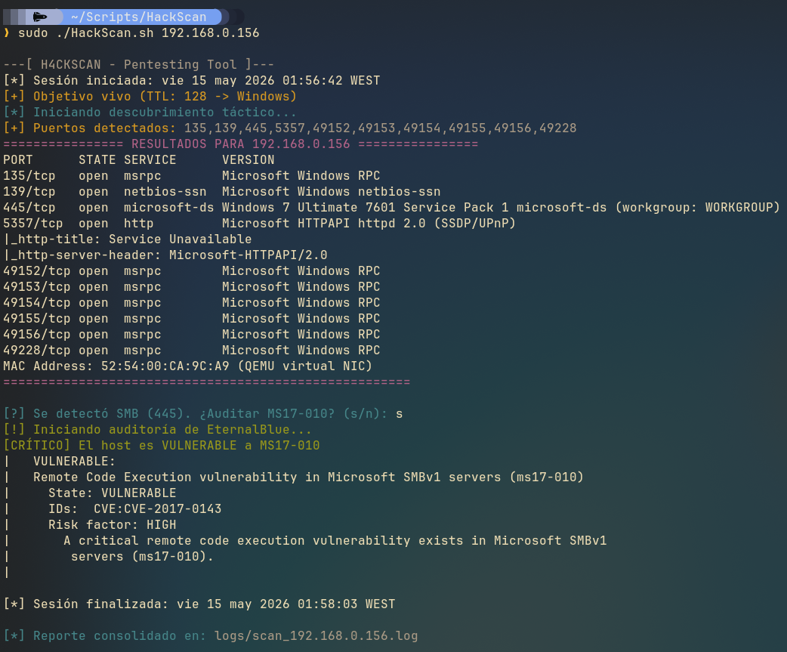

# H4ckScan 

Script en Bash para automatizar el reconocimiento de red. Lo hice para no tener que estar escribiendo los mismos comandos de Nmap una y otra vez y para tener los logs ordenados por IP.

### ¿Qué hace?

* **Detecta el SO:** Mira el TTL del ping para saber si es Windows o Linux antes de lanzar nada.
* **Escaneo en dos pasos:** Primero busca puertos abiertos rápido (`-sS`) y luego solo le lanza el escaneo de servicios (`-sCV`) a esos puertos. Ahorra mucho tiempo.
* **Check de EternalBlue:** Si ve el puerto 445, te pregunta si quieres confirmar si es vulnerable a MS17-010.
* **Logs automáticos:** Crea una carpeta `/logs` y guarda todo ahí con el nombre de la IP.

### Uso

Es básico, solo le pasas la IP:

`./HackScan.sh <IP-objetivo>`

### Requisitos

* Tener `nmap` instalado.
* Ejecutar con `sudo` (para que el escaneo SYN funcione).

---
**Autor:** Kosdays  
**Créditos:** Inspirado en las clases de S4vitar y lo que voy aprendiendo en la comunidad.
